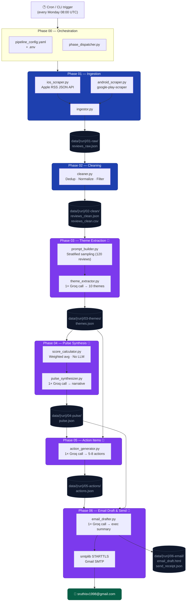

# App Review Pulse — System Architecture

## 1. System Overview

**App Review Pulse** is an automated weekly pipeline that scrapes Ind Money app reviews from the Apple App Store and Google Play Store, uses Groq's LLM to extract themes and generate actionable intelligence, and delivers a polished HTML email to the product team every Monday.

| Property | Value |
|---|---|
| **Frequency** | Weekly (auto) + On-demand (`--run-label`, `--force`) |
| **Data flow** | Linear, file-based. Each phase reads from the previous phase's output folder |
| **API calls** | Exactly **one** Groq call per LLM phase per run — enforced by idempotency guards |
| **Test suite** | 52 offline unit tests across Phases 03–06 (Groq + SMTP fully mocked) |

---

## 2. Architecture Diagram



---

## 3. Tech Stack

### Core Pipeline

| Layer | Technology | Purpose |
|---|---|---|
| **Language** | Python 3.14 | All phases |
| **Config** | PyYAML + python-dotenv | `pipeline_config.yaml` + `.env` |
| **CLI** | `argparse` (stdlib) | `--run-label`, `--force`, `--lookback` flags |

### Phase 01 — Ingestion

| Component | Technology | Notes |
|---|---|---|
| iOS scraper | `requests` + Apple RSS JSON API | `https://itunes.apple.com/{country}/rss/customerreviews/` |
| Android scraper | `google-play-scraper` | Paginated, date-filtered |
| Review schema | Python `dataclass` | Canonical `Review` object across both platforms |

### Phase 02 — Cleaning

| Component | Technology | Notes |
|---|---|---|
| Deduplication | Python sets + `review_id` | Cross-platform hash |
| CSV export | `csv` (stdlib) | `reviews_clean.csv` |
| JSON export | `json` (stdlib) | `reviews_clean.json` |

### Phase 03–06 — LLM Phases

| Component | Technology | Notes |
|---|---|---|
| **LLM Provider** | [Groq](https://groq.com) | Ultra-fast inference |
| **Model** | `llama-3.3-70b-versatile` | Replaces deprecated `llama3-8b-8192` |
| **Client** | `groq` Python SDK | Used in all 4 LLM phases |
| **JSON enforcement** | `response_format: json_object` | Groq native structured output |
| **Fallback parser** | `re.search` regex | Handles LLM prose wrapping JSON |

### Phase 03 — Theme Extraction

| Component | Technology |
|---|---|
| Stratified sampling | Pure Python — random + bucketing by week + rating |
| Output | `themes.json` — 10 themes with sentiment, avg rating, quotes |

### Phase 04 — Pulse Synthesis

| Component | Technology |
|---|---|
| Health score | Pure math (weighted avg rating, sentiment penalty) — **no LLM** |
| Narrative | 1× Groq call |
| Output | `pulse.json` — score, label, narrative, watch list |

### Phase 05 — Action Items

| Component | Technology |
|---|---|
| Action generation | 1× Groq call — P1/P2/P3 priorities, categories, effort |
| Output | `actions.json` — 5–8 prioritised PM actions |

### Phase 06 — Email Draft & Send

| Component | Technology | Notes |
|---|---|---|
| Executive summary | 1× Groq call | 3-sentence VP-ready paragraph |
| HTML template | Pure Python f-strings | Inline CSS, responsive, dark header |
| Email send | `smtplib` STARTTLS (stdlib) | Gmail App Password auth |
| Output | `email_draft.html` + `send_receipt.json` |

### Testing

| Component | Technology |
|---|---|
| Test runner | `pytest` |
| Mocking | `unittest.mock.patch` |
| Scope | 52 unit tests, fully offline — Groq & SMTP mocked |

---

## 4. Pipeline Data Flow

```
data/
└── {run-label}/                  ← e.g. historical-12w or 2026-W08
    ├── 01-raw/
    │   └── reviews_raw.json      ← Phase 01 output
    ├── 02-clean/
    │   ├── reviews_clean.json    ← Phase 02 output
    │   └── reviews_clean.csv
    ├── 03-themes/
    │   └── themes.json           ← Phase 03 output  (1 Groq call)
    ├── 04-pulse/
    │   └── pulse.json            ← Phase 04 output  (1 Groq call)
    ├── 05-actions/
    │   └── actions.json          ← Phase 05 output  (1 Groq call)
    └── 06-email/
        ├── email_draft.html      ← Phase 06 output  (1 Groq call)
        └── send_receipt.json
```

**Total Groq calls per weekly run: 4** (one per LLM phase).  
If a phase's output already exists, it is skipped — **zero calls**.

---

## 5. Idempotency & Re-run Strategy

Every LLM phase follows the same guard pattern:

```python
if output_path.exists():
    logger.info("Output exists — skipping API call.")
    return
```

| Flag | Behaviour |
|---|---|
| `--force` | Deletes cached output for the requested phase, forces one new API call |
| No flag | Skips phase entirely if output exists — safe to re-run the full pipeline |
| `--lookback N` | Phase 01 scrapes the last N weeks in one run (default: 12) |
| `--draft-only` | Phase 06 saves HTML but skips SMTP send |

---

## 6. Scheduling

| Mode | Mechanism |
|---|---|
| **Weekly auto** | Cron / GitHub Actions Schedule — every Monday 08:00 UTC |
| **Manual re-run** | `python phase_dispatcher.py --run-label 2026-W08 --force` |

---

## 7. LLM Usage Boundaries

| Phase | LLM? | Call count | Purpose |
|---|---|---|---|
| 01 — Ingestion | ❌ | 0 | Deterministic scraping |
| 02 — Cleaning | ❌ | 0 | Rule-based dedup & normalisation |
| 03 — Theme Extraction | ✅ | **1** | Classify 120 sampled reviews into themes |
| 04 — Pulse Synthesis | ✅ | **1** | Write narrative pulse (score computed without LLM) |
| 05 — Action Items | ✅ | **1** | Generate P1/P2/P3 PM actions |
| 06 — Email Draft | ✅ | **1** | Write executive summary paragraph |

---

## 8. Future Extensions

| Extension | Notes |
|---|---|
| **Slack integration** | Push pulse summary to `#product-updates` after Phase 06 |
| **Jira integration** | Auto-create draft tickets from Phase 05 P1 actions |
| **Notion sync** | Archive weekly pulse into a Notion database |
| **Streamlit dashboard** | Browse historical pulses, trend charts, rating over time |
| **Competitor tracking** | Parallel ingestion pipeline for competitor app reviews |
