# App Review Pulse — System Architecture

## 1. System Overview

**App Review Pulse** is an automated weekly pipeline that scrapes Ind Money app reviews from the Apple App Store and Google Play Store, uses Groq's LLM to extract themes and generate actionable intelligence, and delivers a polished HTML email to the product team every Monday.

| Property | Value |
|---|---|
| **Frequency** | Weekly (auto) + On-demand (`--run-label`, `--force`) |
| **Data flow** | Linear, file-based. Each phase reads from the previous phase's output folder |
| **API calls** | Exactly **one** Groq call per LLM phase per run — enforced by idempotency guards |
| **Test suite** | 52 offline unit tests across Phases 03–06 (Groq + SMTP fully mocked) |

---

## 2. Architecture Diagram

```mermaid
flowchart TD
    classDef phase fill:#1e40af,color:#fff,stroke:#1e3a8a,rx:8
    classDef data  fill:#0f172a,color:#94a3b8,stroke:#334155,rx:4
    classDef llm   fill:#7c3aed,color:#fff,stroke:#5b21b6,rx:8
    classDef out   fill:#065f46,color:#fff,stroke:#064e3b,rx:8

    CRON["🕐 Cron / CLI trigger\n(every Monday 08:00 UTC)"]

    subgraph P00["Phase 00 — Orchestration"]
        direction TB
        CFG["pipeline_config.yaml\n+ .env"]
        ORCH["phase_dispatcher.py"]
    end

    subgraph P01["Phase 01 — Ingestion"]
        IOS["ios_scraper.py\nApple RSS JSON API"]
        AND["android_scraper.py\ngoogle-play-scraper"]
        ING["ingestor.py"]
    end

    subgraph P02["Phase 02 — Cleaning"]
        CLN["cleaner.py\nDedup · Normalize · Filter"]
    end

    subgraph P03["Phase 03 — Theme Extraction 🤖"]
        PB["prompt_builder.py\nStratified sampling (120 reviews)"]
        TE["theme_extractor.py\n1× Groq call → 10 themes"]
    end

    subgraph P04["Phase 04 — Pulse Synthesis 🤖"]
        SC["score_calculator.py\nWeighted avg · No LLM"]
        PS["pulse_synthesizer.py\n1× Groq call → narrative"]
    end

    subgraph P05["Phase 05 — Action Items 🤖"]
        AG["action_generator.py\n1× Groq call → 5-8 actions"]
    end

    subgraph P06["Phase 06 — Executive Insights 🤖"]
        INS["executive_insights.py\n1× Groq call → Curated Top 3"]
    end

    subgraph P07["Phase 07 — PDF Generation"]
        PDFG["pdf_generator.py\nHigh-fidelity fpdf2 one-pager"]
    end

    subgraph P08["Phase 08 — Email Dispatch"]
        SEND["email_sender.py\nSMTP + Attachments (PDF/HTML)"]
    end

    subgraph P09["Phase 09 — Storage"]
        STOR["history_archiver.py\nRegistry update"]
    end

    INSIGHTS[("data/{run}/06-insights/\ninsights.json")]
    PDF[("data/{run}/07-pdf-report/\nPulse_Report.pdf")]
    EMAIL[("data/{run}/08-email/\nsend_receipt.json")]

    INBOX["📧 sruthisv1998@gmail.com"]

    CRON --> P00
    P00 --> P01
    IOS --> ING
    AND --> ING
    ING --> RAW

    RAW --> P02
    CLN --> CLEAN

    CLEAN --> P03
    PB --> TE
    TE --> THEMES

    THEMES --> P04
    SC --> PS
    PS --> PULSE

    PULSE --> P05
    THEMES --> P05
    AG --> ACTIONS

    ACTIONS --> P06
    PULSE --> P06
    INS --> INSIGHTS

    INSIGHTS --> P07
    PDFG --> PDF

    PDF --> P08
    INSIGHTS --> P08
    SEND --> INBOX
    SEND --> EMAIL

    EMAIL --> P09

    class P01,P02,P07,P09 phase
    class P03,P04,P05,P06 llm
    class P08 out
    class RAW,CLEAN,THEMES,PULSE,ACTIONS,INSIGHTS,PDF,EMAIL data
    class INBOX out
```



---

## 3. Tech Stack

### Core Pipeline

| Layer | Technology | Purpose |
|---|---|---|
| **Language** | Python 3.11 | All phases |
| **Config** | PyYAML + python-dotenv | `pipeline_config.yaml` + `.env` |
| **CLI** | `argparse` (stdlib) | `--run-label`, `--force`, `--lookback` flags |

### Phase 01 — Ingestion

| Component | Technology | Notes |
|---|---|---|
| iOS scraper | `requests` + Apple RSS JSON API | `https://itunes.apple.com/{country}/rss/customerreviews/` |
| Android scraper | `google-play-scraper` | Paginated, date-filtered |
| Review schema | Python `dataclass` | Canonical `Review` object across both platforms |

### Phase 02 — Cleaning

| Component | Technology | Notes |
|---|---|---|
| Deduplication | Python sets + `review_id` | Cross-platform hash |
| CSV export | `csv` (stdlib) | `reviews_clean.csv` |
| JSON export | `json` (stdlib) | `reviews_clean.json` |

### Phase 03–06 — LLM Phases

| Component | Technology | Notes |
|---|---|---|
| **LLM Provider** | [Groq](https://groq.com) | Ultra-fast inference |
| **Model** | `llama-3.3-70b-versatile` | Replaces deprecated models |
| **Client** | `groq` Python SDK | Used in all LLM phases |
| **JSON enforcement** | `response_format: json_object` | Groq native structured output |
| **Fallback parser** | `re.search` regex | Handles LLM prose wrapping JSON |

### Phase 06 — Executive Insights

| Component | Technology | Notes |
|---|---|---|
| Curation | 1× Groq call | Distills Top 3 Themes/Quotes/Actions |
| Output | `insights.json` | Unified data for PDF and Email |

### Phase 07 — PDF Generation

| Component | Technology | Notes |
|---|---|---|
| Report Gen | `fpdf2` | High-fidelity dark-themed one-pager |
| Layout | Rose/Slate Palette | Optimized for mobile/PM eyes |

### Phase 08 — Email Dispatch

| Component | Technology | Notes |
|---|---|---|
| Delivery | `smtplib` (Gmail App Password) | Automated weekly send |
| Attachments | Multipart/Mixed | Attaches both PDF and HTML copy |

### Testing

| Component | Technology |
|---|---|
| Test runner | `pytest` |
| Mocking | `unittest.mock.patch` |
| Scope | End-to-end orchestration + Phase unit tests |

---

## 4. Pipeline Data Flow

```
data/
└── {run-label}/                  ← e.g. historical-12w or 2026-W08
    ├── 01-raw/
    │   └── reviews_raw.json      ← Phase 01 output
    ├── 02-clean/
    │   ├── reviews_clean.json    ← Phase 02 output
    ├── 03-themes/
    │   └── themes.json           ← Phase 03 output
    ├── 04-pulse/
    │   └── pulse.json            ← Phase 04 output
    ├── 05-actions/
    │   └── actions.json          ← Phase 05 output
    ├── 06-insights/
    │   └── insights.json         ← Phase 06 output (Top 3 Brain)
    ├── 07-pdf-report/
    │   └── Pulse_Report.pdf      ← Phase 07 output
    ├── 08-email/
    │   └── send_receipt.json     ← Phase 08 output
    └── 09-storage/
        └── (Archived files)
```

**Total Groq calls per weekly run: 4** (P03, P04, P05, P06).

---

## 5. Idempotency & Re-run Strategy

Every LLM phase follows the same guard pattern:

```python
if output_path.exists():
    logger.info("Output exists — skipping API call.")
    return
```

| Flag | Behaviour |
|---|---|
| `--force` | Deletes cached output for the requested phase, forces one new API call |
| No flag | Skips phase entirely if output exists — safe to re-run the full pipeline |

---

## 6. Scheduling

| Mode | Mechanism |
|---|---|
| **Weekly auto** | GitHub Actions Schedule — every Monday 08:00 AM IST |
| **Manual re-run** | `python phase-00-orchestration/orchestrator.py --week 2026-W08 --force` |

---

## 7. LLM Usage Boundaries

| Phase | LLM? | Call count | Purpose |
|---|---|---|---|
| 01 — Ingestion | ❌ | 0 | Deterministic scraping |
| 02 — Cleaning | ❌ | 0 | Rule-based dedup |
| 03 — Themes | ✅ | **1** | Classify reviews |
| 04 — Pulse | ✅ | **1** | Write narrative |
| 05 — Actions | ✅ | **1** | Generate prioritised tasks |
| 06 — Insights | ✅ | **1** | Curate Top 3 for Reports |
| 07 — PDF Report| ❌ | 0 | Formatting only |
| 08 — Email | ❌ | 0 | SMTP Delivery |

---

## 8. Dashboard

The system features an interactive **Streamlit Dashboard** that consumes historical run data (`data/history/`). Stakeholders can browse trends and deep-dive into themes through a high-fidelity dark UI.
